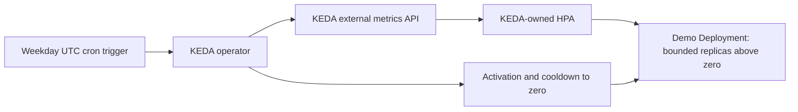

# KEDA — Kubernetes Scaling

[](https://github.com/imos64/keda-kubernetes/actions/workflows/validate.yml)

**Event-driven horizontal Pod scaling.** KEDA 2.20.2 with a deterministic weekday cron example, 0–5 replicas, and a five-minute cooldown. The schedule is an event source; queue and broker integrations require their own authentication and metric contracts.

An independent integration package with versioned upstream artifacts, reviewable configuration and non-deployment CI. It is not a benchmark ranking or a production certification.

```text
Cron event → KEDA → generated HPA → Deployment replicas
```

## High-Level Architecture

KEDA evaluates the UTC cron trigger and controls activation plus its generated HPA. The example can scale the ordinary Service to zero outside the scheduled interval.



## Validate locally

Use Linux amd64, Python 3.12+, Helm 3.21.3 and Make. Validation downloads checksum-verified kubeconform v0.8.0 and uses Kubernetes 1.35.0 schemas; Internet access is required. Custom resources are checked against pinned upstream CRD schemas, and CRDs against Kubernetes' official OpenAPI schema. Admission behavior, CEL rules and live controller behavior require a real staging API server.

```bash
python3 -m venv .venv
. .venv/bin/activate
pip install -r requirements-dev.txt
make validate
make smoke
```

`make render` refreshes the committed installation preview after configuration changes. Validation checks exact render equality and upstream artifact checksums. It never deploys controllers, edits IAM or adds/removes nodes.

## Install and schedule a workload

Check for an existing KEDA installation and an existing owner of `external.metrics.k8s.io`. This chart manages cluster-wide RBAC, CRDs, certificate rotation and admission/metrics services. The sample creates a KEDA-owned HPA; do not also apply a standalone HPA to its Deployment.

```bash
helm upgrade --install keda vendor/keda-2.20.2.tgz -n keda --create-namespace -f values.yaml
kubectl -n keda rollout status deployment/keda-operator
kubectl apply -f examples/workload.yaml
kubectl apply -f examples/scaledobject.yaml
kubectl -n keda-demo get scaledobject,hpa,pods
```

The cron trigger requests three replicas on weekdays from 08:00 to 18:00 UTC. Outside that interval the minimum is zero after cooldown. Set the timezone and schedule for your actual workload; scale-to-zero makes this ordinary Service unavailable outside the active interval. Cron is a reproducible no-secret example, not an HTTP request activation mechanism. Event backlog processing would require an appropriate scaler, credentials via TriggerAuthentication/workload identity, and idempotent workers.

Check ScaledObject Ready/Active conditions, generated HPA conditions and operator logs. Test both activation and deactivation at a deliberately chosen test schedule. Cooldown controls the return to zero; HPA behavior controls normal replica adjustments above zero.

For rollback, pause/remove the ScaledObject and set a reviewed fixed replica count. Deleting the ScaledObject may remove its owned HPA. Do not uninstall the operator or delete CRDs until all managed workloads have an intentional replacement policy.

## Verification and ownership

Local validation completed on 2026-09-07: artifact checksum checks, deterministic rendering, standard/custom resource schemas and scaling/transport guardrails. The demo also passed real local HTTP health, concurrent CPU work and counter checks. No live autoscaler reconciliation, node provisioning, cloud IAM operation or cluster installation was performed. See [validation details](docs/validation.md) and [integration boundaries](docs/integration.md).

Upstream installation artifacts retain their original licensing. `package.json` records exact source URLs and SHA-256 checksums. Controller and demo application images are digest-pinned using verified registry manifests. Re-resolve image digests and review release notes when promoting an upgrade. [Official upstream documentation](https://keda.sh/docs/2.20/).
